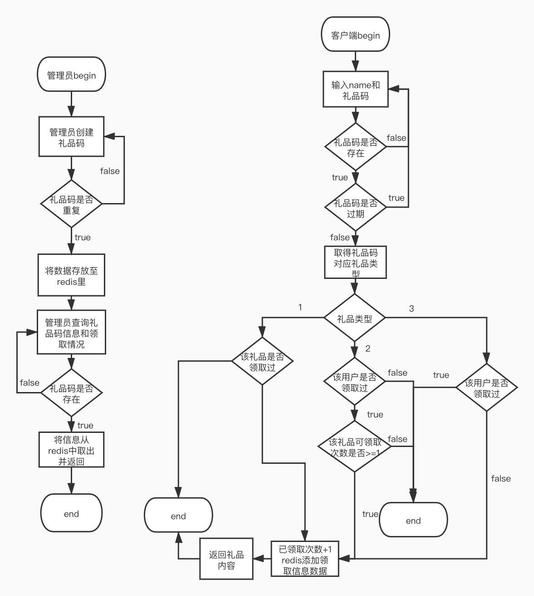

## 项目简介

​	1、本项目主要实现了创建和验证礼品码，最终效果为管理员通过接口创建礼品码，用户领取礼品码，并且管理员可以查询礼品码使用情况。

## 快速上手

​	1、本项目由Go语言开发，数据库采用redis。需要配置Go开发环境，以及安装redis数据库

​	2、进入项目根目录，通过命令行命令启动项目

​			1、go build main.go		---编译

​			2、./main 						  ---启动项目

## 目录结构

```tree
├── README.md
├── __pycache__
│   └── locust.cpython-39.pyc
├── app
│   ├── http
│   │   └── httpServer.go
│   ├── main
│   └── main.go
├── go.mod
├── go.sum
├── internal
│   ├── ctrl
│   │   └── giftController.go
│   ├── globalError
│   │   ├── error.go
│   │   └── errorHandler.go
│   ├── handler
│   │   ├── giftHandler.go
│   │   └── giftHandler_test.go
│   ├── model
│   │   ├── GifCodetInfo.go
│   │   ├── ReceiveInfo.go
│   │   ├── redisPool.go
│   │   └── redisTemplate.go
│   ├── router
│   │   └── Routes.go
│   ├── service
│   │   └── giftService.go
│   ├── utils
│   │   └── GeneralUtils.go
│   └── verify
│       └── paramter.go
├── locust.py
└── report.html
```


## 代码逻辑分层

| 层          | 文件夹                           | 主要职责             | 调用关系                    | 其它说明     |
| ----------- | -------------------------------- | -------------------- | --------------------------- | ------------ |
| 应用层      | /app/http/httpServer.go          | 服务器启动           | 调用路由层                  | 不可同层调用 |
| 路由层      | /internal/router/Routes.go       | 路由转发             | 被应用层调用，调用控制层    | 不可同层调用 |
| 控制层      | /internal/ctrl/giftController.go | 参数校验、请求处理   | 被路由层调用，调用handler   | 不可同层调用 |
| handler层   | /internal/handler/giftHandler.go | 通用业务处理         | 被控制层调用，调用service层 | 不可同层调用 |
| 工具层      | /utils/GeneralUtils.go           | 生成随机码           | 被handler调用               | 不可同层调用 |
| Verify      | /internal/verify                 | 参数校验             | 被ctrl调用                  | 不可同层调用 |
| 模型层      | /internal/model                  | 数据模型、数据库操作 | 被handler、service调用      | 可同层调用   |
| service     | /internal/service                | 通用业务逻辑         | 被handler调用、调用模型层   | 可同层调用   |
| globalError | /internal/globalError            | 统一异常处理         | 被router调用                | 不可同层调用 |

## 存储设计

礼品码信息

| 内容                                                         | 数据库 | Key            |
| ------------------------------------------------------------ | ------ | -------------- |
| 创建人员                                                     | Redis  | CreateUser     |
| 创建时间                                                     | Redis  | CreateTime     |
| 礼品码                                                       | Redis  | GiftCode       |
| 礼品描述                                                     | Redis  | Description    |
| 礼品码种类   1、指定用户一次性消耗 2、不指定用户限制兑换次数 3、不限用户不限次数兑换 | Redis  | GiftType       |
| 过期时间戳                                                   | Redis  | Validity       |
| 可领取次数                                                   | Redis  | AvailableTimes |
| 礼品内容列表  1001:金币 1002:钻石 1003:道具 1004:英雄 1005:小兵 | Redis  | GiftDetail     |

领取列表key为

| key                  | Filed    | Value | 数据库 |
| -------------------- | -------- | ----- | ------ |
| 前缀DETAIL_+giftCode | Username | Time  | Redis  |

已领取次数

| 内容       | 数据库 | Key                                 |
| ---------- | ------ | ----------------------------------- |
| 已领取次数 | Redis  | 前缀AVAILABLE_+对应的礼品码giftCode |

## 接口设计

### 1、管理员创建礼品码接口

#### 请求方法

http POST

#### 接口地址

http://127.0.0.1:8080/createAndGetGiftCode

#### 请求参数

```
{
    "userName":"admin",  
    "description":"十周年纪念",
    "giftType":"2",
    "validity":"10m",
    "availableTimes":"20",
    "giftDetail":"{"1001":"2","1003":"3"}",
}
```

#### 请求响应

```
{
    "data": "6502M6S6"
}
```

### 2、管理员查询礼品码接口

#### 请求方法

http GET

#### 接口地址

http://127.0.0.1:8080/getGiftDetail

#### 请求参数

```
giftCode=6502M6S6
```

#### 请求响应

```
{
    "data": {
        "AvailableDetail": {
            "smallbai": "2021-07-27 21:05:13",
            "yangzhenghai": "2021-07-27 21:05:28"
        },
        "AvailableTime": "2",
        "AvailableTimes": "20",
        "CreateTime": "2021-07-27 21:02:31",
        "CreateUser": "admin",
        "Description": "十周年纪念",
        "GiftCode": "6502M6S6",
        "GiftDetail": "{\"1001\":\"2\",\"1003\":\"3\"}",
        "GiftType": "2",
        "Validity": "1627391551"
    },
    "status": 200
}
```

### 3、用户领取礼品接口

#### 请求方法

http POST

#### 接口地址

http://127.0.0.1:8080/redeemGift

#### 请求参数

```
"giftCode": "6502M6S6"
"userName": "smallbai"
```

#### 请求响应

```
{
    "data": "{\"1001\":\"2\",\"1003\":\"3\"}",
    "status": 200
}
```

### 响应状态码

| 状态码 | 说明                     |
| ------ | ------------------------ |
| 无     | 成功                     |
| 1001   | 服务器异常               |
| 1002   | redis连接异常            |
| 1003   | 礼品码已过期             |
| 1004   | 该用户已经领取过礼品码了 |
| 1005   | 礼品码不存在/错误        |
| 1006   | 礼品码已失效             |
| 1007   | 礼品被领取完毕           |
| 1008   | 参数为空                 |
| 1009   | 参数不合法               |

## 第三方库

### gin

```
go语言的web框架
https://github.com/gin-gonic/gin
```

### go-redis

```
go语言连接操作redis数据库
https://github.com/go-redis
```

## 如何编译执行

进入app目录编译

```
go build
```

运行可执行文件

```
./app
```

## todo

将代码进一步分层

## 流程图



